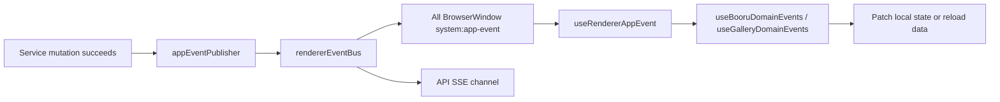

# 全局领域事件与跨窗口状态同步设计规格

- **日期**：2026-06-09
- **对应缺陷**：`doc/done/Bug记录.md` Bug5
- **对应审查**：`doc/全局领域事件与跨窗口状态同步缺陷审查.md`
- **对应执行计划**：`doc/superpowers/plans/2026-06-09-global-domain-events-sync-fix.md`
- **范围**：Electron 主进程权威状态变更、跨窗口广播、API SSE、renderer 跨页面状态消费

---

## 1. 背景

项目已经有一条可用的跨窗口事件传输链路：

1. 主进程构造 `RendererAppEvent`
2. `src/main/services/rendererEventBus.ts` 广播到所有 `BrowserWindow`
3. 同一事件桥接到 API SSE
4. renderer 通过 `window.electronAPI.system.onAppEvent` 订阅

但现有事件模型覆盖面太窄。`RendererAppEvent` 当前只覆盖批量下载会话、收藏标签、图库导入、图库列表和缩略图事件。大量主进程权威状态变更仍停留在“调用方自己刷新”的模式，导致多窗口、保活页、轻量子窗口和 API SSE 订阅者之间状态漂移。

Bug5 的典型表现是：

- Booru 本地收藏后，其他页面红心状态不更新
- 服务端喜欢 / 取消喜欢后，搜索页、详情页、服务端收藏页状态不同步
- 新增或移除黑名单标签后，其他窗口的列表过滤、命中统计、详情标签菜单不刷新
- API HTTP 路由修改收藏 / 喜欢后，桌面窗口和 `booru` SSE 频道都不知道

这个问题不是某个页面漏了一次 `reload()`，而是缺少统一领域事件规范和消费抽象。

---

## 2. 目标

1. 建立独立的全局领域事件模块，作为以后新增功能对接跨窗口同步的统一入口。
2. 明确哪些状态变化必须发全局领域事件，哪些状态不应进入事件总线。
3. 让 Booru、Gallery、批量下载、配置、备份恢复、API 服务运行态等主进程权威状态变更都有事件。
4. 让 renderer 页面通过统一 hook 消费事件，避免每页手写 `onAppEvent`。
5. 修复 Bug5 中本地收藏、服务端喜欢、黑名单的 P0 可见状态漂移。
6. 确保 API SSE 与桌面窗口收到同一套业务事实变更。
7. 保留高频进度 raw channel，避免把领域事件总线变成字节级进度流。

---

## 3. 非目标

1. 不引入 Redux、Zustand、React Query 等新状态库。
2. 不把局部 UI 状态做成全局事件，例如弹窗开关、hover、表单草稿、详情页展开折叠。
3. 不把页面查询状态直接做成领域事件，例如当前页码、搜索框输入草稿、当前 tab。
4. 不移除现有高频下载进度通道。下载进度可以继续走专用 IPC，业务状态变化才进入领域事件。
5. 不在本规格中重写 Booru 站点适配层语义。

---

## 4. 判断标准

一个状态变化应进入全局领域事件，需满足以下条件之一：

| 判断项 | 说明 | 示例 |
|---|---|---|
| 主进程权威状态 | 已写入数据库、配置文件、主进程服务内存或外部站点 | 收藏、黑名单、配置、API 服务状态 |
| 多入口修改 | 可能来自主窗口、子窗口、IPC、API、后台任务 | API 删除收藏、后台修复收藏、导入黑名单 |
| 多页面依赖 | 多个页面依赖它展示按钮、列表、过滤、数量、标记 | 红心、喜欢、黑名单过滤、图库封面 |
| 旧状态可见错误 | stale 会让用户看到明显错误 | 已删图仍显示、黑名单不生效 |
| payload 可轻量化 | 事件只传变更事实，完整数据由 consumer 按需拉取 | `affectedCount`、`postId`、`siteId` |

不应进入全局领域事件的状态：

- 当前 hover / focus
- modal open
- loading spinner
- 输入框草稿
- 图片查看器缩放
- 当前页码、当前滚动位置
- webview 内部状态
- `localStorage` 主题状态，短期用 `storage` 事件同步

---

## 5. 架构设计

### 5.1 模块边界

| 模块 | 职责 |
|---|---|
| `src/shared/appEvents.ts` | 定义 `RendererAppEvent` union、payload、source、API channel 映射、API-safe DTO |
| `src/shared/types.ts` | re-export 事件类型，保持现有导入兼容 |
| `src/main/services/appEventPublisher.ts` | 主进程发布 helper，屏蔽事件构造细节 |
| `src/main/services/rendererEventBus.ts` | 继续负责广播窗口和桥接 API SSE |
| `src/renderer/hooks/useRendererAppEvent.ts` | 统一封装 `system.onAppEvent`，支持常驻订阅、active gating、dirty replay |
| `src/renderer/hooks/useBooruDomainEvents.ts` | Booru 事件按站点过滤和常见 patch 入口 |
| `src/renderer/hooks/useGalleryDomainEvents.ts` | Gallery 图片、相册、无效图片、缩略图事件消费入口 |

### 5.2 数据流

### 5.3 发布原则

1. 事件从 service 层发布，不从 renderer 或 IPC handler 临时补。
2. API HTTP route 与 IPC route 必须共享同一 service emit。
3. 只有 mutation 成功后才发布事件。
4. payload 不携带完整列表或敏感配置，只携带变更事实。
5. 对批量导入、批量重试、批量删除使用聚合事件，不逐条刷屏。
6. 本地路径暴露到 API SSE 前必须经过 `ApiSafeRendererAppEvent` 脱敏。

### 5.4 消费原则

1. 页面不直接手写 `window.electronAPI.system.onAppEvent`，统一使用 hook。
2. hook 常驻订阅，页面隐藏时只标脏，不直接退订。
3. 轻量子窗口也必须消费同一事件，因为 preload 已暴露 `system.onAppEvent`。
4. 能局部 patch 的先 patch，例如 `postId` 对应红心状态。
5. 数据结构复杂或批量变更时防抖 reload。
6. 新窗口和新 SSE 订阅者不依赖事件重放，初始状态仍需主动拉取。

---

## 6. 事件目录

### 6.1 Booru

| 事件 | 触发场景 | 关键 payload | 主要消费者 |
|---|---|---|---|
| `booru:post-favorite-changed` | 本地收藏新增、移除、修复、移动分组 | `siteId`, `postId`, `isFavorited`, `action` | Booru 列表、详情页、收藏页、子窗口 |
| `booru:post-server-favorite-changed` | 服务端喜欢 / 取消喜欢、本地 liked 同步 | `siteId`, `postId`, `isLiked` | 搜索页、详情页、服务端收藏页 |
| `booru:blacklist-tags-changed` | 黑名单新增、批量新增、导入、编辑、启停、删除 | `siteId`, `tagName`, `isActive`, `affectedCount` | BooruPage、TagsSection、BlacklistedTagsPage |
| `booru:sites-changed` | 站点新增、编辑、删除、active site、登录登出 | `siteId`, `activeSiteId`, `changedFields` | BooruSettingsPage、站点选择器、各 Booru 页 |
| `booru:favorite-groups-changed` | 收藏分组 CRUD、收藏移动分组 | `groupId`, `postId`, `action` | BooruFavoritesPage |
| `booru:saved-searches-changed` | 保存搜索 CRUD | `searchId`, `siteId`, `action` | BooruSavedSearchesPage |
| `booru:search-history-changed` | 搜索历史新增 / 清空 | `siteId`, `affectedCount` | 搜索历史下拉 |
| `booru:post-download-state-changed` | 入队、完成、失败、删除、清空、标记已下载 | `queueId`, `siteId`, `postId`, `status` | BooruDownloadPage、卡片下载状态 |
| `booru:post-vote-changed` | 投票成功 | `siteId`, `postId`, `vote`, `score` | 详情页 Toolbar |
| `booru:image-cache-cleared` | 清空 Booru 图片缓存 | `affectedCount` | Booru 详情页 / 缓存统计 |

### 6.2 Gallery

| 事件 | 触发场景 | 关键 payload | 主要消费者 |
|---|---|---|---|
| `gallery:images-imported` | 扫描 / 同步导入新图片 | `galleryId`, `imported`, `reason` | Gallery recent |
| `gallery:images-changed` | 图片新增、删除、标签更新、无效化 | `imageId`, `affectedImageIds`, `galleryId`, `action` | GalleryPage、ImageGrid |
| `gallery:galleries-changed` | 相册创建、更新、删除、统计、封面变化 | `galleryId`, `action` | 相册列表、详情、封面 |
| `gallery:invalid-images-changed` | 无效图片上报、删除、清空 | `invalidImageId`, `originalImageId`, `galleryId` | InvalidImagesPage、GalleryPage |
| `gallery:ignored-folders-changed` | 忽略文件夹新增、编辑、删除 | `ignoredFolderId`, `folderPath` | IgnoredFoldersModal |
| `thumbnail:generated` | 缩略图生成成功 / 失败 | `imagePath`, `thumbnailPath`, `success` | ImageGrid、图库封面 |

### 6.3 下载与系统

| 事件 | 触发场景 | 关键 payload | 主要消费者 |
|---|---|---|---|
| `bulk-download:sessions-changed` | 会话创建、去重、状态变化、删除、重试合并 | `sessionId`, `taskId`, `status`, `reason` | BooruBulkDownloadPage、FavoriteTagsPage |
| `bulk-download:tasks-changed` | 批量下载任务 CRUD / 去重 | `taskId`, `siteId`, `action` | BooruBulkDownloadPage |
| `bulk-download:records-changed` | record 创建、终态、pending reset、retry merge | `sessionId`, `recordId`, `status`, `affectedCount` | 会话详情、API downloads SSE |
| `favorite-tag-download:created` | 收藏标签下载创建 | `favoriteTagId`, `taskId`, `sessionId` | 下载中心、收藏标签页 |
| `favorite-tags:changed` | 收藏标签 CRUD、分组、绑定、下载状态变化 | `favoriteTagId`, `tagName`, `action` | FavoriteTagsPage、TagsSection、标签子页面 |
| `config:changed` | 配置保存、页面偏好、图库根目录、API 配置 | `version`, `sections` | App、SettingsPage、BooruPreferences |
| `app:data-restored` | 备份恢复成功 | `mode`, `restoredTables` | 所有保活页面做全量失效 |
| `api-service:status-changed` | API 服务启动、停止、运行错误 | `running`, `enabled`, `baseUrl`, `lastError` | SettingsPage、API SSE system |

---

## 7. API SSE

`RendererAppEvent` 应通过统一映射进入 API SSE：

| channel | 事件 |
|---|---|
| `booru` | 所有 `booru:*` |
| `downloads` | `bulk-download:*` 与未来 `download:*` |
| `favorite-tags` | `favorite-tags:changed`、`favorite-tag-download:created` |
| `system` | `gallery:*`、`thumbnail:*`、`config:changed`、`app:data-restored`、`api-service:status-changed` |
| `api-logs` | API log 专用旁路，仍由现有 API log 机制发布 |

`API_EVENT_CHANNELS` 应成为 channel 白名单的单一来源，被 `eventHub`、`eventRoutes`、`permissions` 共享。

---

## 8. 关键页面行为

### 8.1 BooruPage

- 收到 `booru:blacklist-tags-changed` 后重拉 active blacklist。
- `blacklistTagNames` 更新后，当前页过滤结果和命中统计立即重新计算。
- 收到 `booru:post-favorite-changed` 后按 `postId` patch `isFavorited`。
- 收到 `booru:post-server-favorite-changed` 后 patch `isLiked` 和 `serverFavorites`。

### 8.2 TagsSection

- 收到 `favorite-tags:changed` 后重拉当前站点收藏标签。
- 收到 `booru:blacklist-tags-changed` 后重拉当前站点黑名单 Map。
- 使用 site token 防止快速切站时旧请求回写。

### 8.3 轻量子窗口

`BooruTagSearchPage`、`BooruArtistPage`、`BooruCharacterPage` 必须接入 Booru 领域事件。否则主窗口补了事件，子窗口仍然 stale。

### 8.4 GalleryPage / ImageGrid

- 收到 `gallery:images-changed(deleted|invalidated)` 后，必须按 `imageId` 从本地数组剔除。
- 只做 after-cursor 增量不够，因为删除和无效化不会产生“更新后新图片”。
- `ImageGrid` 不能只处理缩略图，还要能响应图片删除 / 无效化。

### 8.5 SettingsPage / App

- `config:changed` 不再只是旧 IPC 事件，也进入统一 `RendererAppEvent`。
- `App` 根据 `ui.pagePreferences.appShell` 重拉菜单 / 固定页偏好。
- `SettingsPage` 根据 `apiService`、`network`、`galleries` 等 section 重拉对应配置。

---

## 9. 兼容策略

1. 旧 `config.onConfigChanged` 暂时保留，避免破坏已有 preload API。
2. `config:changed` 同时走旧 IPC 与新 `RendererAppEvent`，后续可逐步迁移 consumer。
3. 下载高频进度 raw channel 暂时保留。
4. 旧 `BOORU_FAVORITES_REPAIR_DONE` 可保留给专用 toast，但实际收藏删除 / 修复也必须发 `booru:post-favorite-changed`。
5. `src/shared/types.ts` re-export 新事件类型，避免一次性改全仓导入。

---

## 10. 验收标准

### 10.1 自动化

- `npm run build:main` 通过
- `npm run build:preload` 通过
- `npm run test` 通过
- 新增事件类型测试覆盖全部事件名和 channel 映射
- service 层事件测试覆盖 IPC 与 API 共用写入口
- renderer hook 测试覆盖常驻订阅、inactive 标脏、active replay
- Booru 页面测试覆盖收藏、喜欢、黑名单跨组件同步
- Gallery 页面测试覆盖删除 / 无效图片从可见列表移除
- Settings/App 测试覆盖 `config:changed` 消费

### 10.2 手工验证

1. 打开两个 Booru 页面，同一站点同一帖子，收藏一边后另一边红心更新。
2. 服务端喜欢 / 取消喜欢后，搜索页、详情页、服务端收藏页同步。
3. 在详情标签菜单加入黑名单后，当前 Booru 列表立即隐藏命中图片。
4. 黑名单管理页批量新增 / 导入后，详情页标签菜单和 BooruPage 过滤同步。
5. 子窗口 tag-search / artist / character 能收到收藏和喜欢事件。
6. 删除本地图片后，recent/all/gallery detail/ImageGrid 都不再显示死图。
7. 无效图片上报后，无效图片列表、图库封面、图库计数同步。
8. 修改 API 服务配置后，另一个 Settings 窗口刷新运行态。
9. 备份恢复后，已打开页面按领域重载。
10. `/api/v1/events/booru` 能收到 Booru 事件，`/api/v1/events/system` 能收到配置和 Gallery 事件。

---

## 11. 风险与约束

| 风险 | 处置 |
|---|---|
| 事件数量扩大导致重复刷新 | hook 内防抖，批量操作用聚合事件 |
| 页面隐藏期间错过事件 | 常驻订阅 + dirty replay |
| API SSE 暴露本地路径 | `ApiSafeRendererAppEvent` 脱敏 |
| service emit 破坏测试 mock | 事件发布器集中 mock，避免每个 service 自己拼事件 |
| `config:changed` 双通道重复消费 | consumer 统一选新 hook；旧 API 仅兼容保留 |
| 新窗口无事件重放 | 文档明确事件是失效提示，新窗口必须初始拉取 |

---

## 12. 后续维护规范

新增功能如果写入主进程权威状态，应按以下顺序接入：

1. 在 `src/shared/appEvents.ts` 增加事件 payload 和 union 成员。
2. 在 `appEventPublisher.ts` 增加命名发布 helper。
3. 在 service mutation 成功后调用 helper。
4. 在 renderer 领域 hook 中增加过滤和分发。
5. 在实际页面中 patch 或 reload。
6. 补 service 测试、hook 测试、页面消费测试。
7. 更新 Renderer API / 领域文档事件表。

禁止新增页面直接散写 `window.electronAPI.system.onAppEvent`，除非该页面本身就是事件 hook 的底层测试或临时诊断工具。

---

## 13. 2026-06-09 实施结果

本规格已完成第一版落地，当前代码中的 source of truth 为：

- `src/shared/appEvents.ts`：事件 union、payload、source、API SSE channel 映射、API-safe DTO。
- `src/main/services/appEventPublisher.ts`：主进程 service 层统一发布 helper。
- `src/main/services/rendererEventBus.ts`：窗口广播与 API SSE 桥接。
- `src/renderer/hooks/useRendererAppEvent.ts`：renderer 通用事件订阅。
- `src/renderer/hooks/useBooruDomainEvents.ts`：Booru 领域事件消费。
- `src/renderer/hooks/useGalleryDomainEvents.ts`：Gallery 领域事件消费。

已按规格补齐：

- Booru：本地收藏、服务端喜欢、黑名单、站点、收藏分组、保存搜索、搜索历史、帖子下载状态、投票、图片缓存清理。
- Gallery：图片变更、无效图、相册变更、忽略文件夹、缩略图生成。
- 下载：批量下载 session、task、record 事件；高频 progress raw channel 保留。
- 系统：`config:changed`、`app:data-restored`、`api-service:status-changed`。
- 消费端：Booru 页面、Gallery 页面、ImageGrid、InvalidImagesPage、IgnoredFoldersModal、BooruBulkDownloadPage、SettingsPage、App 已接入必要的事件消费。

后续维护约束：

- 新增主进程权威状态 mutation 时，必须先判断是否属于全局领域事件；属于时按本规格第 12 节流程接入。
- 不要把 hover、modal open、输入草稿、loading、当前页码等局部 UI 状态放进事件总线。
- `ImageGrid` 已迁移到 `useGalleryDomainEvents`，会响应 `gallery:images-changed(deleted|invalidated)`、`gallery:invalid-images-changed(reported)` 和 `thumbnail:generated`。
- `BooruBulkDownloadPage`、`FavoriteTagsPage` 仍有历史手写订阅，可在后续小步迁移到领域 hook；当前行为已由测试覆盖。

本轮验证通过：

- `npm run test -- tests/main/services/appEventPublisher.test.ts tests/shared/appEvents.test.ts tests/main/services/bulkDownloadService.events.test.ts tests/renderer/pages/BooruBulkDownloadPage.test.tsx tests/main/api/apiServiceManager.test.ts tests/main/services/backupService.test.ts tests/main/ipc/apiServiceHandlers.test.ts`
- `npm run test -- tests/renderer/App.mountedPageIds.test.tsx tests/renderer/App.navigation.test.tsx tests/renderer/pages/SettingsPage.test.tsx tests/renderer/pages/BooruPage.loadingPagination.test.tsx tests/renderer/pages/BooruCharacterPage.test.tsx tests/renderer/pages/BooruPostActions.integration.test.tsx tests/renderer/pages/BooruFavoritesPage.postActions.test.tsx tests/renderer/hooks/useBooruDomainEvents.test.tsx`
- `npm run test -- tests/main/services/booruService.appEvents.test.ts tests/main/services/imageCacheService.atomic.test.ts tests/main/services/bulkDownloadService.eventIntegrity.test.ts tests/renderer/components/ImageGrid.domainEvents.test.tsx`
- `npm run test`
- `npm run build:main`
- `npm run build:preload`
- `npm run build:renderer`
